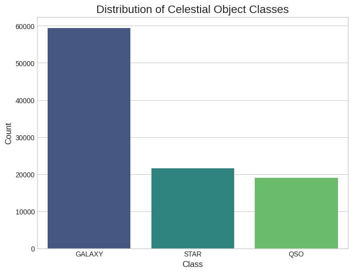

# Final Report: A Comparative Analysis of Machine Learning Models for Stellar Classification

## Introduction

This report details a data science project focused on the classification of celestial objects using data from the Sloan Digital Sky Survey (SDSS). As astronomical surveys generate increasingly vast amounts of data, automated classification using machine learning has become essential for scientific discovery. The primary goal of this project was to build and evaluate a series of models capable of accurately distinguishing between Stars, Galaxies, and Quasars (QSOs) based on their observed physical properties.

The project follows a complete data science workflow, beginning with data curation and exploratory analysis to understand the dataset's features. A baseline model using a Random Forest Classifier was established to set a performance benchmark. This was then compared against several neural network architectures built with TensorFlow/Keras, where advanced techniques like feature engineering and class weighting were applied to optimize performance. The project concludes with a nuanced analysis of the results, highlighting the trade-offs between different modeling approaches for this specific classification task.

## Data Analysis & Computation

### Datasets, Wrangling, & Cleaning

The analysis was performed on a single, curated dataset sourced from Kaggle, based on SDSS Data Release 17.

* **Data Source:** The dataset contains 100,000 observations of celestial objects, each with 18 initial features including photometric data (`u, g, r, i, z` filters), spectroscopic data (`redshift`), and various identifiers.
* **Data Curation Process:**
    * **Dropping Non-Predictive Features:** All identifier columns that do not contain predictive information (e.g., `obj_ID`, `spec_obj_ID`, `run_ID`) were removed. The `rerun_ID` column was also dropped as it contained only a single, constant value.
    * **Handling Erroneous Values:** Initial exploration revealed that a small number of rows contained `-9999` as a placeholder for errors in the photometric features. These rows were dropped to ensure data quality.
    * **Feature Engineering:** New "color" features (`u-g`, `g-r`, `r-i`, `i-z`) were created by calculating the difference between photometric bands, a standard practice in astrophysics to provide more informative features to the models.
    * **Final Dataset:** The final, clean dataset used for modeling was saved to `cleaned_sdss_data.pkl` to ensure a reproducible starting point for all analysis.

### Exploratory Data Analysis (EDA)

The EDA focused on understanding the class distributions and identifying the most promising features for classification.

* **Insight 1: Class Imbalance:** A count plot of the target variable, `class`, revealed a significant imbalance. The dataset contains many `GALAXY` and `STAR` observations but significantly fewer `QSO` observations. This finding informed the need for stratified sampling during the train-test split and for using class-specific metrics like recall for model evaluation.

**

* **Insight 2: `redshift` is a Key Predictor:** A box plot visualizing the `redshift` distribution for each class showed a clear separation. Stars have redshifts near zero, while galaxies have moderate values, and quasars have the highest and most varied redshifts. This indicated that `redshift` would be an extremely powerful feature for the models.

**

### Modeling and Evaluation

The core of the project was a comparative analysis of different machine learning models. The data was prepared by label-encoding the target variable, performing a stratified 80/20 train-test split, and scaling all features with `StandardScaler`.

* **Baseline Model: Random Forest:** A Random Forest Classifier was trained to establish a high-performance baseline. It achieved an outstanding overall accuracy of **97.95%**. A feature importance analysis confirmed the EDA findings, showing `redshift` to be the most influential feature by a large margin.

**

* **Comparative Models: Neural Networks:** Several feed-forward neural networks were built and trained using TensorFlow/Keras to determine if a deep learning approach could outperform the strong baseline. The experiments included:
    1.  A simple "stock" network.
    2.  A deeper and wider network to test the impact of model complexity.
    3.  A network trained with the engineered "color" features.
    4.  A network trained using `class_weights` to specifically address the class imbalance.

* **Final Model Comparison:** The evaluation of all models on the unseen test set yielded a nuanced conclusion.

| Metric | Random Forest (Baseline) | NN (with Class Weights) | **Manual Ensemble** |
| :--- | :--- | :--- | :--- |
| **Overall Accuracy** | **97.95%** | 96.65% | 97.32% |
| **Recall (QSO)** | 0.93 | **0.94** | **0.94** |

## Conclusions and Future Work

### Conclusions

The primary conclusion of this project is that while a **Random Forest model provides the best overall accuracy**, targeted neural network techniques are most effective at solving specific challenges, such as improving the detection of the rare QSO class. The final ensemble model provided a strong balance of both approaches. This demonstrates a critical concept in applied machine learning: the "best" model is highly dependent on the specific business or research objective.

### Future Work

* **Advanced Hyperparameter Tuning:** A more exhaustive search for the optimal neural network architecture could be performed using tools like KerasTuner.
* **Different Architectures:** For a more complex challenge, one could explore different types of neural networks if the data had a different structure (e.g., a CNN if working with the raw image data).
* **Deployment:** The final, best-performing model could be saved and deployed as a simple web application where a user could input object features and receive a classification.

## References & Acknowledgements

* The dataset used for this project is a curated version of the **Sloan Digital Sky Survey (SDSS) Data Release 17**, sourced from Kaggle. Full credit and acknowledgement go to the SDSS team for their incredible work in collecting and sharing this data with the public.
