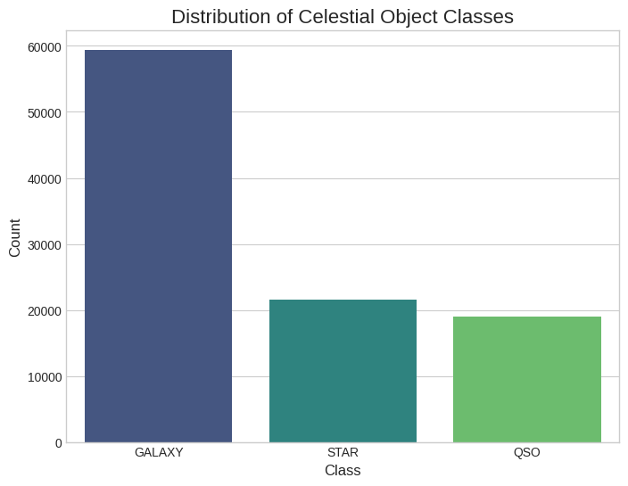

# Stellar Classification: A Machine Learning Project with SDSS Data

## Project Overview

This project utilizes machine learning to classify celestial objects based on data from the Sloan Digital Sky Survey (SDSS) Data Release 17. The primary goal is to build and evaluate models capable of distinguishing between stars, galaxies, and quasars (QSOs) with high accuracy.

The workflow begins with data cleaning and extensive exploratory data analysis (EDA) to understand the dataset's features and their relationships with the object classes. A baseline model using a Random Forest Classifier is established before building and training a neural network with TensorFlow/Keras. The project concludes with a comparative analysis of the two models, demonstrating a complete end-to-end machine learning pipeline.

---

## Dataset

The dataset used is a curated subset of the **Sloan Digital Sky Survey (SDSS) Data Release 17**, sourced from Kaggle. It consists of **100,000 observations**, each with 18 initial features.

* **Target Variable:** `class` (GALAXY, STAR, QSO)
* **Key Predictive Features:**
    * **Photometric Features:** `u`, `g`, `r`, `i`, `z` (magnitudes in different light filters)
    * **Spectroscopic Features:** `redshift` (a measure of an object's recessional velocity)
    * **Positional Features:** `alpha`, `delta` (celestial coordinates)

---

## Project Workflow

1.  **Data Cleaning & Preprocessing:**
    * Removed non-predictive identifier columns (e.g., `obj_ID`, `spec_obj_ID`, `run_ID`).
    * Handled placeholder error values (`-9999`) found in the photometric features.
    * The final, cleaned dataset used for modeling consists of 100,000 observations and 9 feature columns.

2.  **Exploratory Data Analysis (EDA):**
    * Analyzed the distribution of the target classes, identifying a significant class imbalance (fewer QSOs than stars and galaxies).
    * Visualized feature distributions, confirming that `redshift` is a highly powerful and discriminating feature for separating the classes.

3.  **Machine Learning Preparation:**
    * The categorical target `class` was label-encoded into integers.
    * The dataset was split into training (80%) and testing (20%) sets using a stratified split to preserve the class proportions.
    * All features were standardized using `StandardScaler`.

4.  **Modeling and Evaluation:**
    * A **Random Forest Classifier** was trained as a strong baseline model.
    * A **Feed-Forward Neural Network** was built using TensorFlow/Keras and trained as a more complex alternative.
    * Both models were evaluated on the unseen test set using accuracy, a detailed classification report (precision, recall, f1-score), and a confusion matrix.

---

## Key Findings & Visualizations

### Class Distribution
The dataset is imbalanced, with Quasars (QSO) being the minority class. This was accounted for during the train/test split and model evaluation.

**

### Redshift as a Key Predictor
The `redshift` values for Stars, Galaxies, and QSOs occupy very distinct ranges, making it the most powerful single feature for classification.

*[Image of Redshift Box Plot: `eda2.png`]*

### Feature Importance
The Random Forest model confirmed our EDA findings, ranking `redshift` as the most important feature by a large margin.

*[Image of Feature Importance Plot: `feature_importance.png`]*

---

## Model Performance Comparison

A key outcome of this project was the direct comparison between a classic, powerful machine learning model and a neural network.

| Metric | Random Forest (Baseline) | Neural Network |
| :--- | :--- | :--- |
| **Overall Accuracy** | **97.95%** | 96.87% |
| **F1-Score (QSO)** | **0.95** | 0.94 |
| **Recall (QSO)** | **0.93** | 0.92 |

**Conclusion:** The **Random Forest Classifier outperformed the neural network** on this specific, well-structured tabular dataset. This is a crucial finding that highlights the power of tree-based ensembles and demonstrates that a more complex model is not always superior.

---

## Repository Contents

* **`01_Initial_Data_Exploration.ipynb`**: A Jupyter notebook detailing the data loading, cleaning, and exploratory data analysis process.
* **`02_Modeling.ipynb`**: A Jupyter notebook that covers the data preparation for machine learning, training of the Random Forest baseline, and training of the final Neural Network model.
* **`cleaned_sdss_data.pkl`**: The cleaned dataset saved after preprocessing, used as the starting point for the modeling notebook.

## Tools & Libraries Used

* **Python 3**
* **Pandas:** For data manipulation and analysis.
* **Scikit-learn:** For data preprocessing (`StandardScaler`, `LabelEncoder`), model training (`RandomForestClassifier`), and evaluation (`classification_report`, `accuracy_score`).
* **TensorFlow (Keras):** For building and training the neural network.
* **Matplotlib & Seaborn:** For data visualization.
