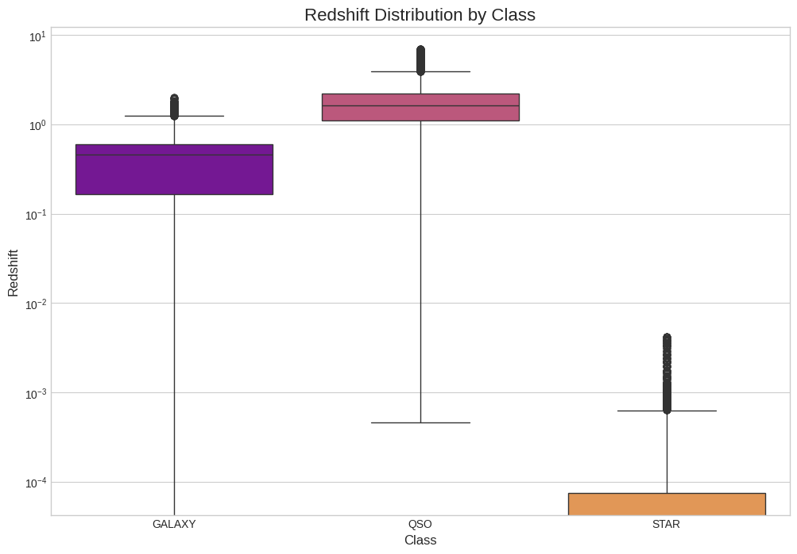
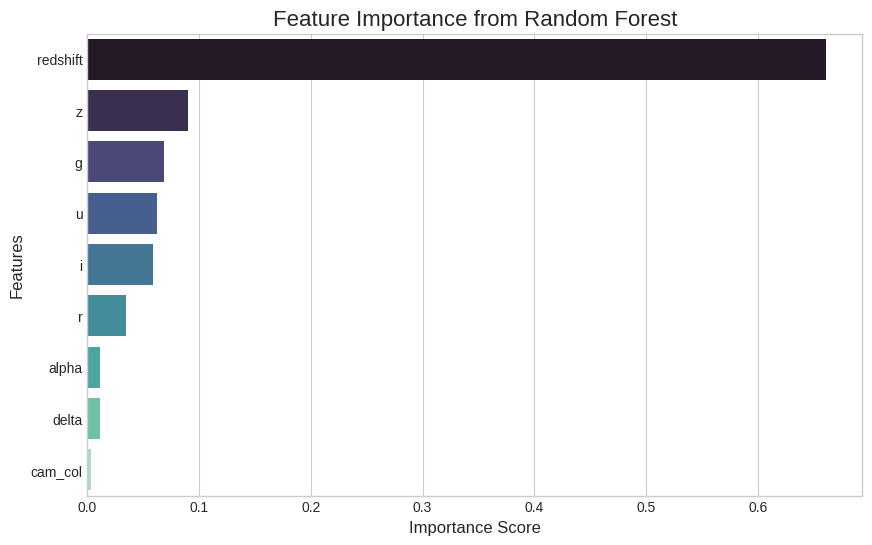

# Stellar Classification: A Machine Learning Project with SDSS Data

## Project Overview

This project utilizes machine learning to classify celestial objects based on data from the Sloan Digital Sky Survey (SDSS) Data Release 17. The primary goal is to build and evaluate a series of models capable of distinguishing between stars, galaxies, and quasars (QSOs) with high accuracy.

The workflow begins with data cleaning, feature engineering, and extensive exploratory data analysis (EDA). A baseline model using a Random Forest Classifier is established and then compared against several neural network architectures and a final voting ensemble model to test various optimization strategies and determine the best model for different objectives.

---

## Dataset

The dataset used is a curated subset of the **Sloan Digital Sky Survey (SDSS) Data Release 17**, sourced from Kaggle. It consists of **100,000 observations**, each with 18 initial features.

* **Target Variable:** `class` (GALAXY, STAR, QSO)
* **Key Predictive Features:**
    * **Photometric Features:** `u`, `g`, `r`, `i`, `z` (magnitudes in different light filters)
    * **Spectroscopic Features:** `redshift` (a measure of an object's recessional velocity)
    * **Positional Features:** `alpha`, `delta` (celestial coordinates)

---

## Project Workflow

1.  **Data Cleaning & Preprocessing:** Non-predictive identifier columns were dropped and placeholder error values (`-9999`) were handled.
2.  **Feature Engineering:** New "color" features (e.g., `u-g`, `g-r`) were created from the raw photometric features to provide more predictive information to the models.
3.  **Exploratory Data Analysis (EDA):** The cleaned data was visualized to understand feature distributions and the dataset's class imbalance.
4.  **Machine Learning Preparation:** The data was prepared for modeling using `scikit-learn` for label encoding, stratified train-test splitting, and feature scaling.
5.  **Comparative Modeling:** A Random Forest model was trained to set a high-performance baseline. It was then compared against multiple neural network configurations and a final soft-voting ensemble model to test different optimization strategies.

---

## Key Findings & Visualizations

### Class Distribution
The dataset is imbalanced, with Quasars (QSO) being the minority class. This was accounted for during model evaluation.

**

### Redshift as a Key Predictor
The `redshift` values for Stars, Galaxies, and QSOs occupy very distinct ranges, making it the most powerful single feature for classification.

**

### Feature Importance
The Random Forest model confirmed our EDA findings, ranking `redshift` as the most important feature by a large margin.

**

---

## Model Performance Comparison

The central outcome of this project is the nuanced comparison between the baseline model and the various advanced modeling techniques.

| Metric | Random Forest (Baseline) | NN (with Class Weights) | **Manual Ensemble** |
| :--- | :--- | :--- | :--- |
| **Overall Accuracy** | **97.95%** | 96.65% | 97.32% |
| **Recall (QSO)** | 0.93 | **0.94** | **0.94** |

### Conclusion on Model Performance

The key takeaway is that the "best" model depends on the specific performance objective:
1.  **Best Overall Model:** The **Random Forest Classifier** provided the best **overall accuracy**, making it the most reliable model for general-purpose classification on this dataset.
2.  **Best for the Specific Problem:** For the specific challenge of finding the highest number of rare Quasars, the **Neural Network with Class Weights** and the final **Manual Ensemble** were superior, both achieving the highest **recall (94%)** for the QSO class.
3.  **The Value of Ensembling:** The final ensemble model successfully balanced the strengths of its components, improving on the neural network's accuracy while maintaining its high recall for the minority class.

This demonstrates that while a simpler model may achieve the best general accuracy, advanced techniques like class weighting or ensembling can be necessary to optimize for specific, important outcomes like detecting rare events.

---

## Repository Contents

* **`01_Initial_Data_Exploration.ipynb`**: A Jupyter notebook detailing the data loading, cleaning, feature engineering, and exploratory data analysis process.
* **`02_Modeling.ipynb`**: A Jupyter notebook that covers the ML data preparation, baseline model (Random Forest), all neural network experiments, and the final ensemble model and its evaluation.
* **`cleaned_sdss_data.pkl`**: The processed and cleaned dataset, used as the input for the modeling notebook.

## Tools & Libraries Used

* **Python 3**
* **Pandas & NumPy**
* **Scikit-learn**
* **TensorFlow (Keras)**
* **Scikeras**
* **Matplotlib & Seaborn**
